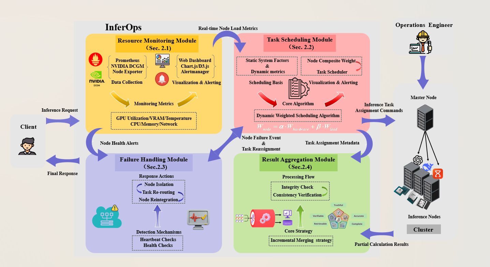
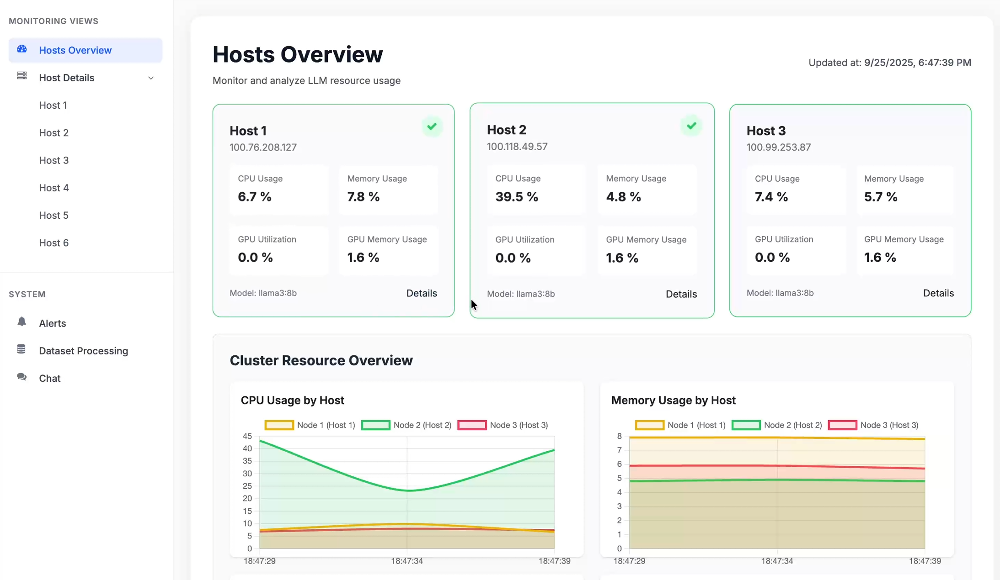
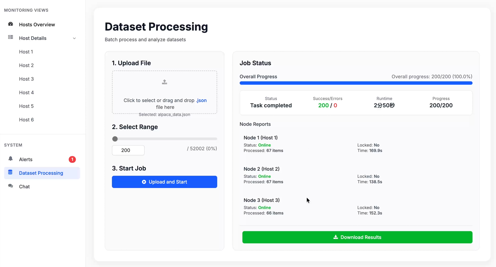
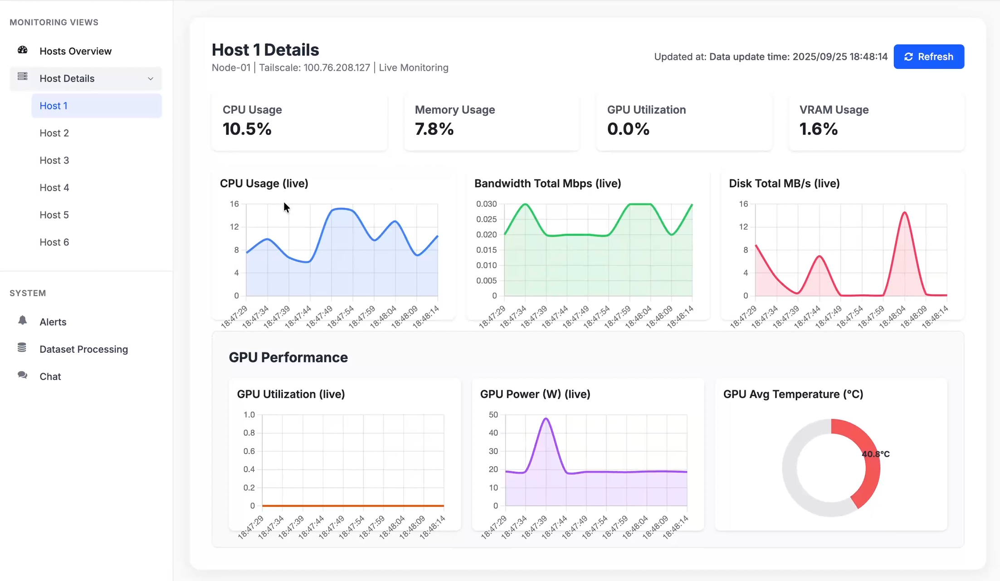

<!-- markdownlint-disable MD013 MD033 -->
<div align="right">

[English](./README.md) | [中文](./README.zh-CN.md)

</div>

# InferOps

  

**InferOps** is an operations platform designed for efficient and reliable LLM inference service in cloud. It integrates four core modules: resource monitoring, task scheduling, failure handling, and result aggregation, into a unified architecture. InferOps aims to solve challenges such as inefficient resource utilization, load imbalance, and lack of robustness, particularly when managing diverse requests under high-concurrency and low-latency demands.

This project is particularly suitable for cloud environments where hardware resources may vary in capability across different servers.



### Feature List

| Feature | Description |
| :--- | :--- |
| **Real-time Resource Monitoring** | Provides millisecond-level visibility into the entire hybrid cluster's health and performance, with a robust stack incorporating Prometheus, DCGM, and custom dashboards. |
| **Dynamic Task Scheduling** | Implements a dynamic weighted scheduling algorithm that considers both static system factors (VRAM, TFLOPS) and dynamic metrics (GPU utilization, memory, temperature) for optimal workload distribution. |
| **Automated Failure Handling** | Ensures high availability through proactive health monitoring and automated recovery. Unhealthy nodes are automatically removed from the pool, and their tasks are seamlessly rerouted. |
| **Incremental Result Aggregation** | Efficiently compiles partial outputs from distributed nodes. An Incremental Merging strategy minimizes end-to-end latency by starting the merging process as soon as partial results are available. |
| **Unified Operations Platform** | Integrates monitoring, scheduling, failure handling, and aggregation into a single, cohesive system for streamlined management of LLM inference. |
| **Visualization Dashboard** | A custom-built web dashboard renders real-time data into intuitive visualizations, allowing administrators to swiftly identify bottlenecks, trends, and anomalies. |
| **Proactive Alerting** | A configurable alerting mechanism triggers notifications based on predefined thresholds (e.g., high GPU temperature or VRAM usage), enabling preemptive intervention. |
| **Secure & Scalable Networking** | Utilizes Tailscale to build a secure virtual private network, simplifying node deployment and enhancing scalability across different network environments. |

## Architecture Design

The InferOps platform adopts a modular architecture, consisting of the following four core modules that work together to accomplish an end-to-end service pipeline:

1.  **Resource Monitoring Module**: The core component providing visibility into the cluster's health. It includes a metrics collection layer, a time-series storage engine (Prometheus), a visualization dashboard (React.js, ECharts), and an alerting mechanism. It uses DCGM for GPU telemetry and lightweight exporters for system metrics.

2.  **Task Scheduling Module**: Responsible for optimal workload distribution. It uses a dynamic weighted scheduling algorithm to dispatch incoming inference requests to the most suitable server, ensuring superior load balancing and maximizing cluster throughput.

3.  **Failure Handling Module**: Ensures high availability and service reliability. It continuously monitors all servers. If a node becomes unresponsive or fails, it is automatically removed from the scheduler's pool, and its tasks are reassigned to healthy nodes.

4.  **Result Aggregation Module**: Handles the efficient compilation of partial outputs. It uses an Incremental Merging strategy to minimize latency by initiating the merging process as soon as a configurable threshold of results is available, without waiting for all nodes to finish.

## Quick Start

### Prerequisites

- Python 3.8+
- Node.js (for frontend development)
- Ollama (installed on each compute node)
- Prometheus (optional, for historical data monitoring)
- Tailscale (recommended, for building a virtual network)

### Deployment Steps

1.  **Clone the repository**

    ```bash
    git clone https://github.com/dpl-project/dpl.git
    cd dpl
    ```

2.  **Install dependencies**

    ```bash
    pip install -r requirements.txt
    ```

3.  **Configure nodes**
    Edit the `gateway/gateway.py` file and update the `NODES` list with the `Tailscale` IP address and `Ollama` service port for each of your compute nodes.

    ```python
    class Settings:
        NODES = [
            {
                "id": 1, "name": "Node 1 (RTX 4090)",
                "monitor_base_url": "http://<TAILSCALE_IP_NODE_1>:8001",
                "llm_url": "http://<TAILSCALE_IP_NODE_1>:11434/api/chat",
            },
            # ...more nodes
        ]
    ```

4.  **Start the monitor agent on each compute node**

    ```bash
    # Navigate to the monitor_agent directory
    cd monitor_agent

    # Start the agent service
    python agent.py
    ```

5.  **Start Ollama on each compute node**
    Install and run Ollama, then pull your desired model, e.g., `ollama run llama3`.

6.  **Start the core gateway**

    ```bash
    # In the project root directory
    python -m uvicorn gateway.gateway:app --reload --host 0.0.0.0 --port 8000
    ```

7.  **Access the frontend**
    Open `http://localhost:8000` in your browser, and you will see the InferOps monitoring and chat interface.

## Showcase

#### 1. Real-time Monitoring Dashboard

*Real-time display of hardware status, load, and online status of all nodes.*

#### 2. Intelligent Chat Interface

*A fully functional chat window, with the backend service provided collaboratively by multiple nodes.*

#### 3. Dataset Parallel Processing

*Upload a JSON dataset, and the system automatically assigns tasks and provides real-time feedback on processing progress.*

#### 4. Historical Performance Analysis

*Through integration with Prometheus, you can perform in-depth analysis of historical performance data of the nodes.*

## Contribution

We welcome community contributions of code and ideas. Here are some directions for further development:

- **More complex scheduling algorithms**: Implement intelligent scheduling strategies based on more dimensions such as model type and predicted task length.
- **Node auto-scaling**: Integrate with cloud service APIs to achieve on-demand auto-scaling of compute nodes.
- **Multi-model routing**: Run multiple different models simultaneously in one cluster and route requests to the correct node based on the `model` parameter in the user request.
- **Frontend enhancements**: Develop richer management features, such as online model management and hot-reloading of node configurations.
- **Edge-Cloud Collaboration**: Extend the platform to support larger-scale edge-cloud collaborative inference.
