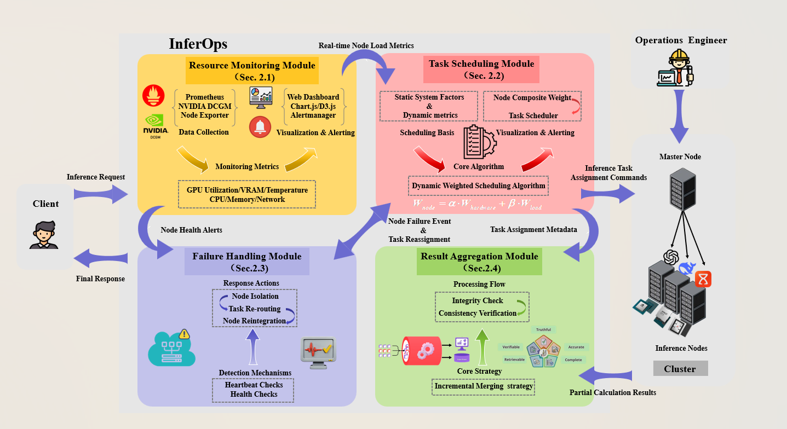
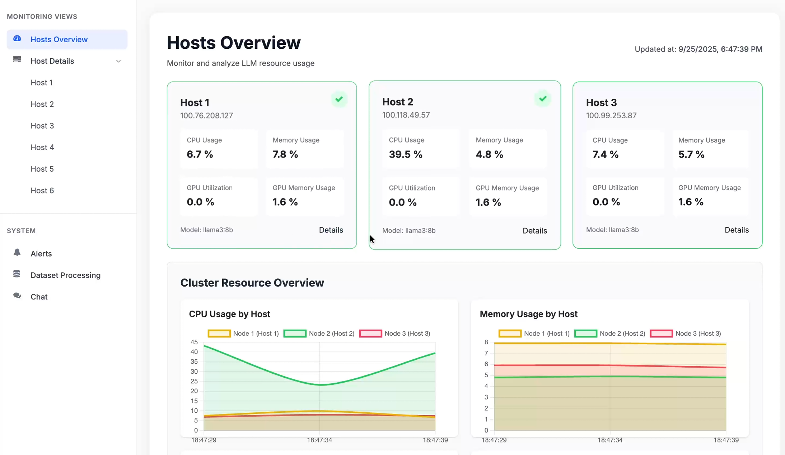
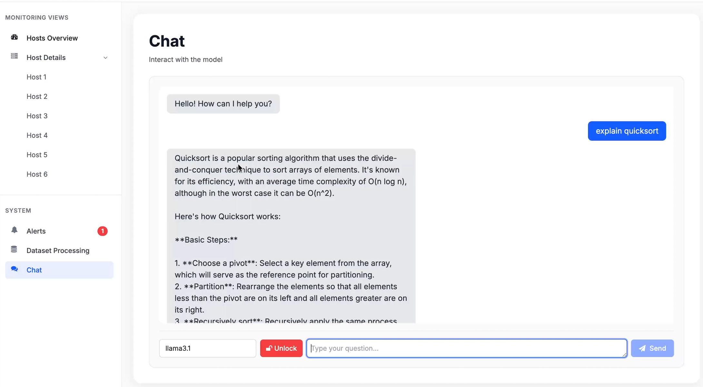
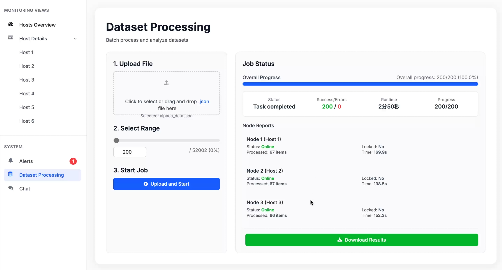
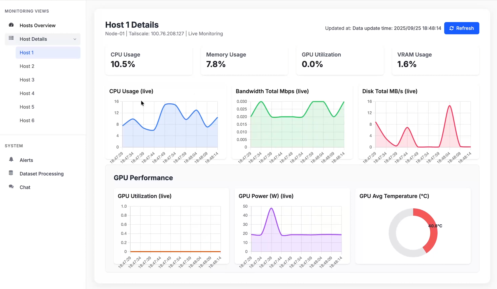

<!-- markdownlint-disable MD013 MD033 -->
<div align="right">

[English](./README.md) | [中文](./README.zh-CN.md)

</div>

# InferOps

  

**InferOps** 是一个为云中高效、可靠的LLM（大语言模型）推理服务设计的操作平台。它将资源监控、任务调度、故障处理和结果聚合四个核心模块集成到一个统一的架构中。InferOps旨在解决资源利用率低、负载不均衡和鲁棒性不足等挑战，特别是在高并发和低延迟要求下管理多样化请求时。

本项目尤其适用于云环境，其中不同服务器的硬件资源能力可能存在差异。



### 功能列表

| 功能 | 描述 |
| :--- | :--- |
| **实时资源监控** | 提供对整个混合集群健康状况和性能的毫秒级可见性，拥有包括Prometheus、DCGM和自定义仪表盘的强大技术栈。 |
| **动态任务调度** | 实现了一种动态加权调度算法，综合考虑静态系统因素（VRAM、TFLOPS）和动态指标（GPU利用率、内存、温度），以实现最优的工作负载分配。 |
| **自动故障处理** | 通过主动健康监控和自动恢复确保高可用性。不健康的节点会自动从池中移除，其任务将被无缝重新路由。 |
| **增量结果聚合** | 高效地将分布式节点生成的部分输出汇编起来。通过增量合并策略，在部分结果可用时即开始合并过程，从而最小化端到端延迟。 |
| **统一操作平台** | 将监控、调度、故障处理和聚合集成到一个单一、内聚的系统中，以简化LLM推理的管理。 |
| **可视化仪表盘** | 一个定制的网络仪表盘将实时数据呈现为直观的可视化图表，使管理员能够快速识别瓶颈、趋势和异常。 |
| **主动告警** | 可配置的告警机制根据预定义阈值（例如，高GPU温度或VRAM使用率）触发通知，从而实现预防性干预。 |
| **安全与可扩展的网络** | 利用Tailscale构建安全的虚拟专用网络，简化节点部署并增强跨不同网络环境的可扩展性。 |

## 架构设计

InferOps平台采用模块化架构，由以下四个核心模块组成，它们协同工作以完成从处理推理请求到交付最终响应的端到端服务流程：

1.  **资源监控模块 (Resource Monitoring Module)**: 作为提供集群健康状况可见性的核心组件。它包括一个指标收集层、一个时间序列存储引擎（Prometheus）、一个可视化仪表盘（React.js, ECharts）和一个告警机制。它使用DCGM进行GPU遥测，并使用轻量级导出器获取系统指标。

2.  **任务调度模块 (Task Scheduling Module)**: 负责最优的工作负载分配。它使用动态加权调度算法将传入的推理请求分派到最合适的服务器，确保卓越的负载均衡并最大化集群吞吐量。

3.  **故障处理模块 (Failure Handling Module)**: 确保高可用性和服务可靠性。它持续监控所有服务器。如果一个节点变得无响应或发生故障，它将自动从调度程序的池中移除，其任务将被重新分配给健康的节点。

4.  **结果聚合模块 (Result Aggregation Module)**: 处理部分输出的高效汇编。它采用增量合并策略，通过在结果达到可配置的阈值时立即启动合并过程来最小化延迟，而无需等待所有节点完成。

## 快速开始

### 环境依赖

- Python 3.8+
- Node.js (用于前端开发)
- Ollama (在每个计算节点上安装)
- Prometheus (可选，用于历史数据监控)
- Tailscale (推荐，用于构建虚拟网络)

### 部署步骤

1.  **克隆代码库**

    ```bash
    git clone https://github.com/dpl-project/dpl.git
    cd dpl
    ```

2.  **安装依赖**

    ```bash
    pip install -r requirements.txt
    ```

3.  **配置节点**
    编辑 `gateway/gateway.py` 文件，在`Settings`类中更新`NODES`列表，填入你每个计算节点的`Tailscale` IP地址和`Ollama`服务端口。

    ```python
    class Settings:
        NODES = [
            {
                "id": 1, "name": "节点 1 (RTX 4090)",
                "monitor_base_url": "http://<TAILSCALE_IP_NODE_1>:8001",
                "llm_url": "http://<TAILSCALE_IP_NODE_1>:11434/api/chat",
            },
            # ...更多节点
        ]
    ```

4.  **在每个计算节点上启动监控代理**

    ```bash
    # 进入 monitor_agent 目录
    cd monitor_agent

    # 启动代理服务
    python agent.py
    ```

5.  **在每个计算节点上启动Ollama**
    安装并运行Ollama，然后拉取你想要的模型，例如 `ollama run llama3`。

6.  **启动核心网关**

    ```bash
    # 在项目根目录
    python -m uvicorn gateway.gateway:app --reload --host 0.0.0.0 --port 8000
    ```

7.  **访问前端**
    在浏览器中打开 `http://localhost:8000`，你将看到InferOps的监控和聊天界面。

## 效果展示

#### 1. 实时监控仪表盘

*实时展示所有节点的硬件状态、负载和在线情况。*

#### 2. 智能聊天界面

*一个功能完整的聊天窗口，后端由多个节点协同提供服务。*

#### 3. 数据集并行处理

*上传JSON数据集，系统自动分配任务并实时反馈处理进度。*

#### 4. 历史性能分析

*通过与Prometheus集成，可以对节点的历史性能数据进行深入分析。*

## 二次开发

我们欢迎社区贡献代码和想法。以下是一些可供二次开发的方向：

- **更复杂的调度算法**: 实现基于模型类型、预测任务长度等更多维度的智能调度策略。
- **节点自动扩展**: 结合云服务API，实现计算节点的按需自动扩缩容。
- **多模型路由**: 在一个集群中同时运行多个不同模型，并根据用户请求中的`model`参数路由到正确的节点。
- **前端功能增强**: 开发更丰富的管理功能，如在线模型管理、节点配置热更新等。
- **边云协同**: 扩展平台以支持更大规模的边缘-云协同推理。
